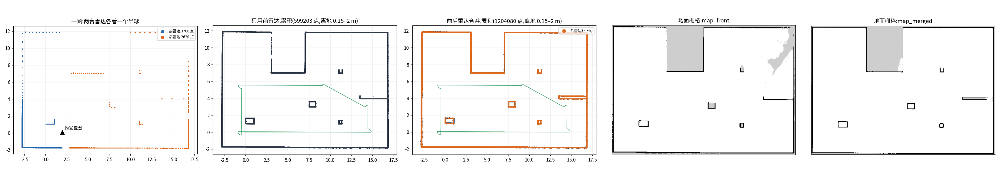

# W09i 前后雷达合并、两头都能当头 · 完工报告

> 设计稿：`docs/superpowers/specs/2026-10-01-W09i-dual-lidar-bidirectional-design.md`（按推荐）。分支 `w09i` → PR。
> 用户 2026-10-01：「用算法把前后雷达算出来的点位合并，把图画出来」「狗子其实两边都可以是头，所以不能只用一边的雷达」「目前暂时没有狗，只能在开发机上做模拟测试」。
> **全部在开发机上做、在仿真里验**；真机项见 `docs/庄园场景待真机测试.md` §3g。

## 一张图

仿真院子 20 × 14 m（墙、小屋、柱子、箱子、矮墙），狗头为前绕一圈、再狗尾在前倒着走 8 m，105 s、两台雷达各 1046 帧（`tools/w09i_sim_bag.py`）。
图由 `tools/w09i_merge_figure.py` 画（真机录包一样能画）。从左到右：
1. 一帧：前雷达（蓝）、后雷达（橙）各看一个半球；
2. 只用前雷达累积；
3. 前后合并累积：橙色是后雷达补上的，比如矮墙背面、小屋右下角；
4. 只用前雷达建的图：右上角有一块灰，是没看见过的；
5. 合并建的图：那块灰补上了。

| 仿真里跑通的整条流水线（开发机，MOLA 真跑） | 结果 |
|---|---|
| 前雷达建图（`d1max-loc build`） | 轨迹误差：平均 2.6 cm、最大 7.8 cm；倒着走那段平均 3.6 cm |
| 标后雷达外参（`calibrate-rear`）。初值故意错 10 cm / 5°，参照用的是 MOLA 自己的轨迹，不是真值 | 209 帧；对上 93%；残差中位数 0.6 cm；守门过了。**离真值 6.5 mm / 0.03°** |
| 合并（`merge-bag`，按轨迹补两台雷达之间的运动） | 1046 帧全拼上 |
| 合并点云建图（`build --lidar-topic /d1max/merged_lidar`） | **轨迹误差：平均 1.4 cm、最大 2.9 cm**；倒着走那段平均 1.4 cm。地面栅格照样逐帧打真射线 |

## 做了什么

| 块 | 内容 | 文件 |
|---|---|---|
| 坐标约定 | **机身系**：x 朝狗头，也就是前雷达那头，不随调头变。HAL 的里程、速度一律按机身系。SDK 调头后的「往前」由适配器换算：旁路进程 hello 报 `follows_head`（参数 `--sdk-follows-head`，默认 1）；狗尾为前且跟着调头时，里程朝向加 π、前进速度反号 | `adapter-d1max/hal.py`、`motion/patrol_agent.cpp`、`agent_frames.py`、`d1max_sim/agent_server.py` |
| 后雷达外参 | `/etc/d1max/lidars.json` 存 `T_front_rear`、`calibrated`、残差、时刻差。没有这份文件就用几何初值（头尾对称：绕上轴转 π、相距 0.8086 m），算没标定。坏文件报错，不悄悄退回初值 | `localizer/lidars.py` |
| 标定 | 把前雷达建图轨迹叠成点地图作参照，后雷达所有帧一起配上去。点到面配准，由粗到细四层体素（0.4 → 0.05 m），不引 scipy（体素键排序 + `searchsorted` 找近邻）。守门三条：对上 ≥ 50%、残差中位数 ≤ 5 cm、离初值 ≤ 0.3 m / 20°。另外核两台雷达的时刻差（≤ 50 ms） | `localizer/calib.py`、`dualbag.py`、`tools.py calibrate-rear` |
| 合并 | 后雷达帧换进前雷达系，跟时刻最近（≤ 50 ms）的前雷达帧拼起来、降采样（5 cm）。下游看到的还是「前雷达系的一帧」，`frames.json`、定位器、MOLA 都不用改。离线用 `merge-bag` 写合并话题，给了轨迹就补运动。在线节点 `d1max-lidar-merge`：外参没标过就只转发前雷达，后雷达没数据也只发前雷达那份 | `localizer/merge.py`、`dualbag.py`、`deploy/d1max-lidar-merge.*`、`install.sh`、`uninstall.sh` |
| 感知 | 后雷达按 `lidars.json` 换进机身系。**标过才用它的「空」**，没标定只用它的「挡」。两头各算一条走廊，狗尾那头的许可 `clear {…, end: "tail"}` 只在三个条件都满足时才发：后雷达标过、这一帧用上了、旁路进程 ≥ 6 号。栅格加 `rear_cal` | `localizer/obstacles.py`、`contract/obsbridge.py` |
| 旁路进程（协议 6） | 许可分两头：SDK 的「往前」走向哪一头，就要哪一头的许可；头尾不知道就不放。往后退照旧不管 | `motion/vel_gate.hpp`、`patrol_agent.cpp`、`test_vel_gate.cpp` |
| 守卫 | 往后退时往后扫，扫过区是往前扫的中心对称（去掉了 W11 的「不许后退」） | `robot-agent/obstacles.py` |
| 导航 | **行进方向** `travel()` 有三种取值：+1 狗头为前；-1 狗尾为前，前提是规划后端配了避障、感知报后雷达标过；0 不许自己走。狗尾为前时，狗尾对着路倒着走、不掉头；到点对的仍是机身朝向（拍照方向）。半路行进方向变了就停。直线桥永远不许狗尾为前 | `bridges/hal_nav.py`、`planned_nav.py` |
| 运行时、站点、手机 | 能力 `tasks.head = {direction, autonomy}`，不能自己走就不收 goto 和巡检。**头尾一变就当场中止并停车**：有人用遥控器调头，就是人在干预。能不能自己走变成不能时也中止。站点按 `autonomy` 派，老狗没有这个字段就按「狗头为前才派」。手机单狗页说清楚 | `runtime.py`、`dispatcher.py`、`site_client.dart` |
| 遥控 | 手机上的「往前」跟着狗现在的头尾走：狗尾为前就往狗尾那头走，跟 W09i 之前一样 | `tasks/teleop.py` |

## 跟设计稿不一样的地方（都往保守的方向）

- **在线合并节点**：后雷达外参没标过就只转发前雷达，不拿几何初值去拼（会重影，定位器吃了反而坏事）。
- **狗尾为前自己走**：要求配了避障、感知报 `rear_cal`，不要求「这一帧后雷达在用」。后雷达短暂掉帧时，身后变成「看不见」，守卫原地等，不必中止。
- **头尾一变就中止**：哪怕调过去之后也能走。
- **`follows_head` 只在旁路进程配一处**：旁路进程用它选许可，hello 报给代理用于换算。这样两边不会配得不一致。

## 测试

- 新增：
  - `lidars.json` 读写与校验；
  - 合并：拼进前雷达系、配对、降级、补运动；
  - 标定：三种错的初值都收回到 1 cm / 0.3° 以内；装法差 90° 拒、点是乱的拒；
  - 感知：标过空也算、狗尾许可、没标定不发、5 号旁路进程不发；
  - C++ 门：许可分两头、`follows_head`、头尾不知道；
  - 仿真旁路进程、d1max 适配器：机身系换算，SDK 跟或不跟调头两种都测；
  - 守卫：往后扫是中心对称、身后有挡就挡；
  - 规划后端在仿真世界里：
    - 狗尾对着路倒着走、路上突然有箱子照样停、绕过去；
    - 没标定或没配避障就不许走；
    - 只开第二层时，狗尾那头的许可挡得住；
    - 半路调头就停；
  - 运行时：狗尾为前能走就收、不能走了当场中止；
  - 遥控在狗尾为前时；站点按 `autonomy` 派；部署单元；`build` 合并话题打真射线；手机文案。
- 全量 Python 0 失败（`w09i` 分支）；手机全量 219 条只挂了下面那条时序测试；`flutter analyze` 干净；C++ `test_vel_gate` 全过、`make patrol_agent` 编过。
- 突变 10 条（仿真旁路进程选许可、适配器换算、感知的协议门与「没标定不用空」、规划后端的 `rear_cal`、半路调头、运行时调头中止、遥控、站点、守卫往后扫）：杀 9 条；活的一条是「调过去之后也能走时运行时不中止」（导航桥自己也停，测不出来），补了「按 `head_not_forward` 中止、不是失败」的测试后杀掉。
- 手机全量里 `live_video_test`「换了健康流之后旧连接要掐掉」在 MOLA 占满 CPU 时挂了两次，单跑 3 次过了 2 次。它是时序测试，跟这一单无关，记下待查。

## 已知限制

- **SDK 调头时到底怎么变没验过**（3g.2）：换算只认两种情况，「跳 π 且往狗尾走」或「不跳且往狗头走」。
- 在线合并不做逐点去畸变：0.6 m/s 下两台雷达差 50 ms ≈ 3 cm。
- 仿真雷达是理想半球：均匀射线、1 cm 噪声、没有遮挡、没有反光。真机的残差、对上占比会差一些，守门阈值可能要按真机调。
- 侧面盲带还在：两台半球雷达都看不见机身两侧，合并也一样，转身仍靠记忆。
- 自己调头（窄通道里代替原地掉头）归 W25。
