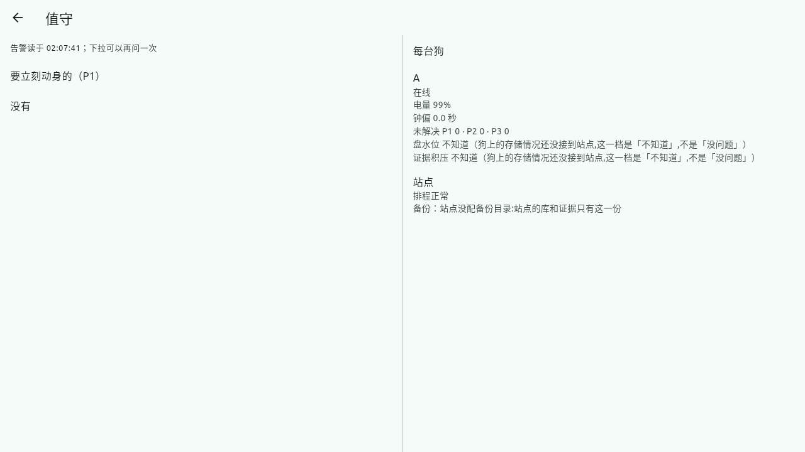

# W15 中央服务器补完 → 桌面版与收尾 · 设计与完工报告

> 分支 `w15-console` → PR。小单：设计与报告合一份。

## 摸底（2026-10-03）：原文过时了

工单原文（2026-09-22）：「`d1max_console` 只有 `ConsoleStore`；补接收入口、鉴权、TLS 与证书钉扎、界面；`http_sink.py` 引用的 `d1max_console.intake` 与 `tests/console/test_no_motion.py` 都不存在」。之后架构改成「站点主机 + 云端控制面」（解耦总设计），这些都已经有了着落：

| 原文要的 | 今天 |
|---|---|
| `d1max_console` | W00c5e 删了，接班的是站点的证据库（`d1max_site/evidence.py`） |
| 接收入口 | 站点 `intake.py`：HTTPS + mTLS、按证书认狗；狗上 `http_sink.py` 指向它 |
| 鉴权、账号、角色 | W00c3：三种角色 × 十种权限、审计 |
| TLS、证书钉扎 | 站点自己的 CA、API 走 HTTPS、MQTT 走 mTLS；手机钉站点证书指纹 |
| 界面 | 手机 app（W00c4、W00c5） |
| `test_no_motion` | 从没写过 —— 这一单补（按决策 5、7 的口径） |

**真正没做的是「庄园外面」**：手机只在庄园局域网里、开着 app 才收得到告警。云端控制面按设计另起仓库，没有代码、没有工单。

**用户决定**（2026-10-03）：
- 决策 27：**第一版只在庄园里用**，不做庄园外访问、不做云端。推荐的是站点主机装 VPN，用户没选。
- 决策 28：用户问「是不是做一个 Windows/Linux/Mac 兼容的 app 会更好」。
  - 我的回答：做，用同一套 Flutter 代码。比另做网页好：功能一样、照样钉证书（网页做不到）、改一处两边都改。
  - 用户选「现在就做，当 W15 的内容」，带键盘遥控。

## 做了什么

### 桌面版（Windows / Linux / macOS）

截图是 Linux 桌面版连开发机上的本机演示站点（`tools/site_demo.py`）。单狗页见 `img/W15-桌面版-单狗页.png`：画面那一栏报「拉不下来」，是演示里没有画面转发，不是桌面版的问题。

| 块 | 内容 | 文件 |
|---|---|---|
| 工程 | `flutter create --platforms=linux,windows,macos`：加 `linux/`、`windows/`、`macos/`。窗口标题「D1 Max 巡检」。生成的计数器样例测试删了，`analysis_options` 自动排除了平台目录 | `mobile/linux` 等 |
| 站点列表文件 | 桌面上放 app 自己的支持目录（Linux `~/.local/share/com.d1max.d1max_patrol/`、Windows `%APPDATA%`、Mac `Application Support`）。原来的 documents 在桌面上是用户的「文档」文件夹，谁都看得见、改得了：站点地址或证书指纹被改掉就是连错站点 | `store/paths.dart` |
| 值守屏 | 窗口宽到 1100 就分两栏：告警一栏、每台狗一栏。横屏手机最宽 900 出头，照旧一栏 | `site_watch_page.dart` |
| 键盘遥控 | W/↑ 前进、S/↓ 后退、A/← 左转、D/→ 右转，**松开就停**；Esc 是「停」（同大红按钮，走站点 halt）。窗口失去焦点当场归零：松开的事件收不到了。只认按下、松开，不认系统连发。还没拿到遥控、没画面时按键不动。只在桌面上显示提示；手机接了蓝牙键盘也认 | `site_teleop.dart` |
| 鼠标 | 鼠标拖也能滚、能「下拉刷新」：Flutter 桌面默认只认触摸、触控板 | `main.dart` 的 `scrollBehavior` |
| 登录 | 口令框弹出来就能打字，回车就登录 | `site_page.dart` |
| CI | 新作业 `desktop`：Linux、Windows、macOS 各编一个包，产物留 14 天可下载。不设必过；只在合进 master、手动触发时跑（macOS 机器按十倍计费）。新用了 GitHub 官方的 `upload-artifact`，按提交哈希钉死 | `.github/workflows/ci.yml` |

### 「站点不自己产生运动」的守门测试（决策 5、7）

扫站点源码的语法树（注释、文档里提到不算），卡住三件事：
1. 站点发给狗的命令种类是一个**封闭的任务级清单**，没有 `vel`、`walk` 这类直接速度命令。新加一种命令要来登记。
2. 遥控帧只在遥控模块的 `_send_frame` 里造；`_send_frame` 只被两处调用：手机来的杆量（`_drive`，原样的 `vx`、`wz` 或零速），和结束时那一帧（`close`，**必须是零速**）。
3. 站点不导入旁路进程的速度协议。

突变 4 条全杀：在排程器里塞一条 `vel`、在待命点模块里造遥控帧、结束那一帧不是零速、转发时把杆量放大。

### 开发机上的本机演示站点

`tools/site_demo.py` 起一整套真东西：站点、Mosquitto（mTLS）、一台仿真狗的代理，跟站点验收测试同一条路。它打印地址（`https://127.0.0.2:8443`）、证书指纹、账号，没有狗也能拿手机、桌面版连上去试。
- 站点 API 绑 `127.0.0.2`：站点只在非回环地址上开 HTTPS，而 app 只认 HTTPS。
- 目录默认放 `~/.cache/d1max-site-demo`：仓库路径带空格，Mosquitto 配置里的路径不许有空格。
- Ctrl+C 一秒内全部收掉。第一版用了屏蔽信号，子进程继承了屏蔽、不理 SIGTERM，要等十几秒超时才杀掉；改成处理函数立旗之后实测 1.1 s。

### 台账

- W15 改写成这一单；
- W16（大部分在 W00c2c 做了）、W17、W18、W20 的「依赖 W15」改成依赖站点已有的部分；
- W17 的 WAN 通道标「第一版不做」；
- 开头「缺中央服务器」那句加了注；
- 记决策 27、28。

## 测试

- **手机**全量 242 条全过，`flutter analyze` 干净。新增：
  - 键盘遥控：拿到遥控之前按键不动；W 前进、A 左转（逆时针，wz 为正）、松开就停、后退右转；失去焦点归零；Esc 停车；只在桌面显示提示；
  - 桌面窗口 1280×720、1920×1080：主要几页不溢出、值守屏分两栏，窄的照旧一栏；
  - 登录回车；鼠标拖动生效。
- **站点**守门测试 3 条，突变 4 条全杀。
- **真机（这台开发机）**：
  - 编出 Linux 桌面版；
  - 在虚拟显示器（Xvfb）里起来，连本机演示站点：HTTPS + 证书钉扎登录、狗列表、单狗页、值守两栏都看到了；
  - 回车登录、鼠标下拉刷新也在真窗口里点过。
  - Windows、macOS 版只靠 CI 编得过，**没在那两种电脑上装过、用过**。
- 全量 Python 0 失败（`w15-console` 分支）。

## 已知限制、要你做的

- **Windows、Mac 版要你在那两种电脑上试一次**：
  - 下载 CI 那一次运行的 Artifacts；
  - Mac 版没签名：第一次右键「打开」；
  - Windows 可能被 SmartScreen 拦，点「仍要运行」。
- 正式分发 Mac 版要苹果开发者账号签名、公证（没做）。
- 桌面版没有系统通知：值守响铃跟手机一样，要 app 开着。
- 键盘遥控没在真狗上试过：跟摇杆同一条路，站点、狗两层夹限速。
- 第一版只在庄园局域网里用（决策 27）：在外面看不了、收不到告警。
